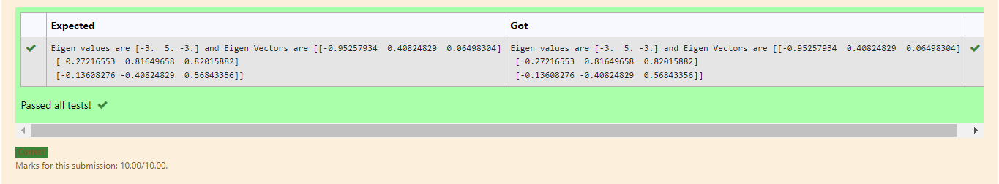

# EIGENVALUES-AND-EIGENVECTORS
## Aim:
To write a python program to find the Eigenvalues and Eigen Vectors
## Equipment’s required:
1. 	Hardware – PCs
2. 	Anaconda – Python 3.7 Installation / Moodle-Code Runner
## Algorithm:
### Step1 : 
Import numpy as np
### Step 2: 
Enter the rows of the matrix for which the Eigen values and eigen vectors are to be found
### Step 3:
 Using the np.linalg.eig(),  we get two results (first is eigenvalue and second is eigenvector) of the given matrix.
### Step 4: 
Print the Eigen values and Eigen vectors
## Program:
```
#Program to find the eigen values and eigen vectors.
#Developed by: kirupanandhan.T
#RegisterNumber:21001418
import numpy as np 

A=np.array([[-2,2,-3],[2,1,-6],[-1,-2,0]]) 

values,vectors=np.linalg.eig(A) 

print('Eigen values are',values,'and Eigen Vectors are',vectors)
```
## Output:

## Result:
Thus the Eigenvalue and Eigenvector is successfully solved using python program
